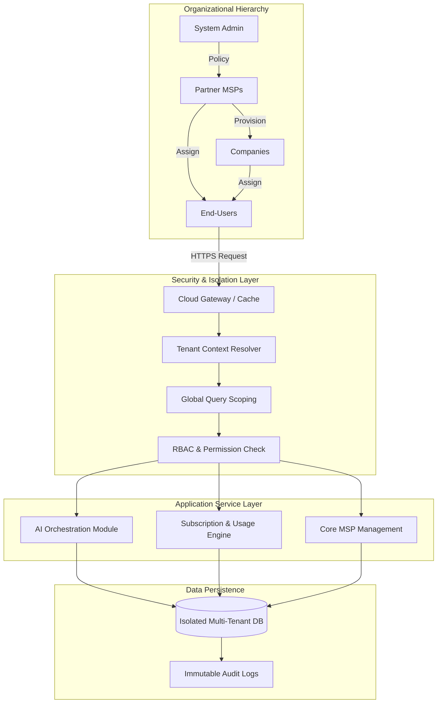

# High-Scale Multi-Tenant SaaS Architecture

  
  
  
  

> **Disclosure**: This repository is for portfolio review and architectural demonstration only. All underlying source code, proprietary algorithms, and specific business processes are the exclusive intellectual property of the original employer. No confidential data or trade secrets are disclosed in this documentation.

## Overview

This project involved the development of a production-ready **Managed Service Provider (MSP) platform** designed to handle complex, hierarchical organizational structures. The system enables seamless management across multiple tiers—from system administrators down to individual clients—while maintaining strict data isolation.

## Core Architectural Challenges Solved

-   **Hierarchical Isolation**: Engineered a "deny-by-default" security model to ensure total data siloing between nested tenants.
-   **AI Service Orchestration**: Integrated a provider-agnostic AI toolkit capable of handling streaming, prompt management, and usage auditing.
-   **Complex Billing Workflows**: Implemented multi-tier and metered billing logic to handle subscription lifecycles across different organizational branches.

## Technical Strategy

The platform utilizes a **Modular Monolith** approach built on **Laravel**, focusing on high maintainability and security.

## Architecture

### Key Architecture Patterns

-   **Action Classes**: Encapsulated business logic for Breach Monitoring and User Onboarding.
-   **AI Orchestration**: Custom `Agent` abstraction for provider-agnostic LLM interactions.
-   **Multi-Tenant Support**: Dedicated `TenantContext` to manage scoping and data isolation.
-   **Test Suite**: 100% coverage on core multi-tenant logic using **Pest**.

### Architecture Diagram.

A visual representation of the request lifecycle, highlighting automated tenant context resolution and secure data scoping within a hierarchical SaaS ecosystem.

The Flow:

---

---

### Multi-Tenancy Engine

-   **Tenant Context Resolution**: Implemented custom middleware to dynamically resolve tenant scope (MSP, Company, or Client) during the request lifecycle.
-   **Global Query Scoping**: Leveraged Eloquent traits to automatically inject tenant-specific filters into all database transactions, preventing cross-tenant data leaks.
-   **Granular RBAC**: Developed a strict Role-Based Access Control system to manage permissions within specific tenant contexts.

### Modular Service Layer

-   **Service Blueprinting**: Designed a system where features are treated as modules that can be provisioned or restricted at the tenant level.
-   **Usage Pipeline**: Built an idempotent event-tracking system to monitor service consumption for accurate metered billing.
-   **Audit & Compliance**: Integrated comprehensive logging to track actor mutations and maintain an immutable record of system changes.

## Tech Stack

-   **Backend**: PHP 8.2+, Laravel.
-   **Frontend**: Livewire, Tailwind CSS, Bootstrap.
-   **Database**: Relational SQL with advanced indexing for multi-tenant performance.
-   **Payments**: Laravel Cashier for subscription and invoice management.
-   **Testing**: Feature and unit testing via **Pest/PHPUnit**, static analysis via **PHPStan**, and code styling via **Laravel Pint**.

## Quality & Standards

Adhered to PSR standards and modern DevOps practices to ensure code reliability:

-   **Performance**: Utilized Redis caching and optimized query structures.
-   **Security**: Implemented secure data handling and encrypted transmission methods.
-   **Documentation**: Maintained clear documentation for internal team collaboration.

## Author & Contact

**Saeed Hosan** [LinkedIn](https://www.linkedin.com/in/saeedhosan) | [Email](mailto:saeedhosansh@gmail.com)

## License

The content of this case study is provided under Creative Commons Attribution-NonCommercial-NoDerivatives 4.0. The proprietary software described remains the property of the copyright holder.
